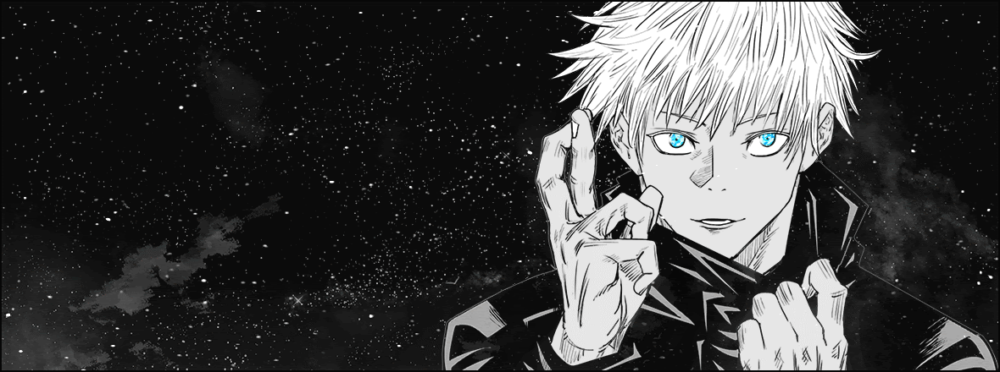

<!-- TOP BANNER (replace the URL with your own banner image) -->

  <!-- Example: use your own GitHub-hosted image at assets/header.jpg -->
 

  

  <!-- If you want to use the example from your friend, uncomment the next line and remove the assets line above:
  
  -->

<h1 align="center">Hey there — I’m Light! </h1>
<!-- 
<em>Student · Engineer · Founder</em>
 -->

<!-- BIG LANGUAGE VISUALS (perfectly centered, no table, clean spacing) -->
<table align="center">
  <tr>
    <td align="center">
       
      Python
    </td>
    <td width="80"></td>
    <td align="center">
       
      C
    </td>
  </tr>
</table>

---

## 📊 GitHub Stats

  
  

---

<!-- GetLoli counter (different artpack) -->

  

> _"Stay hungry, stay foolish."_ — **Steve Jobs**
